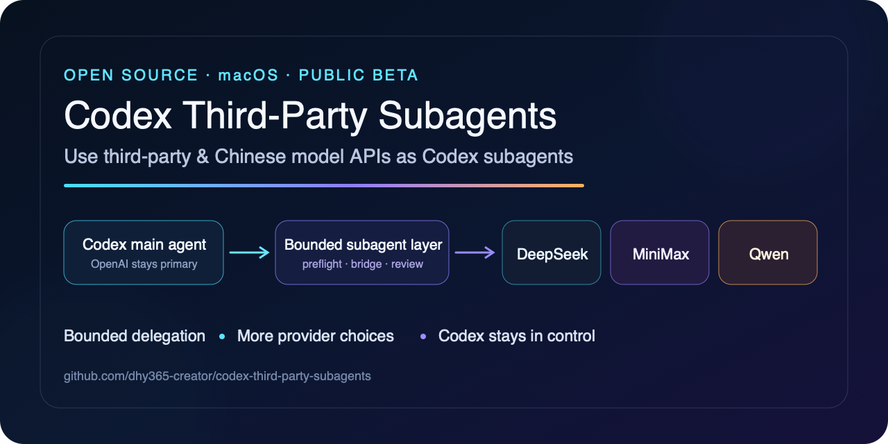
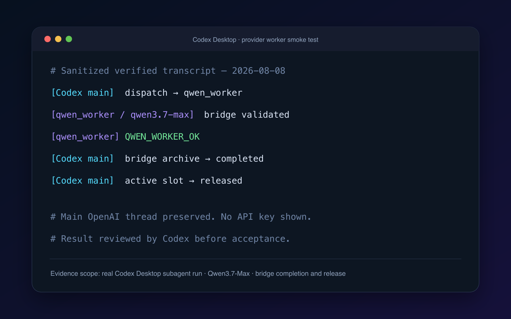
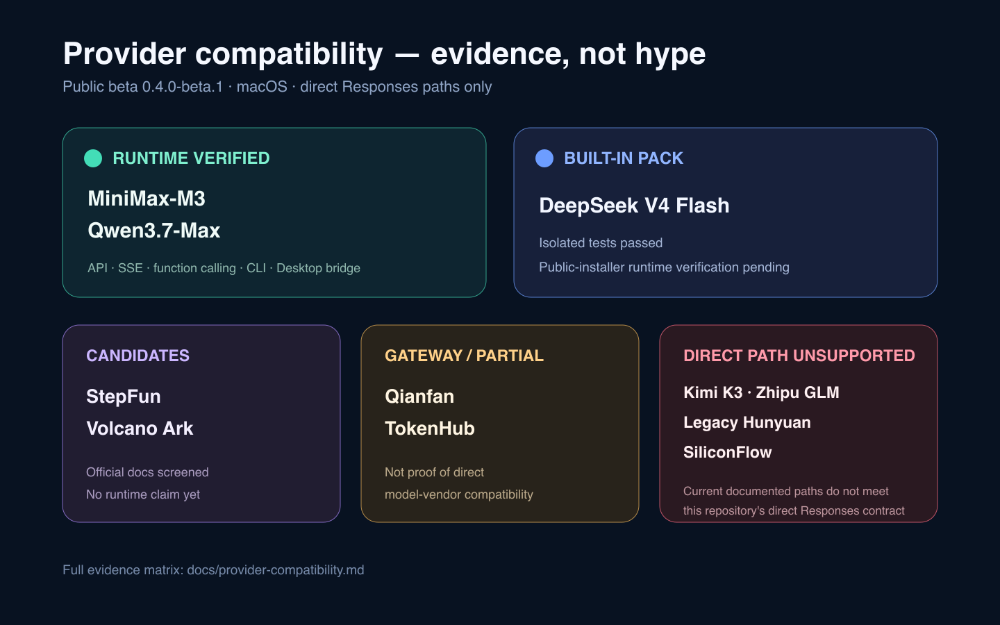
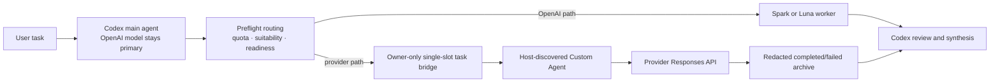
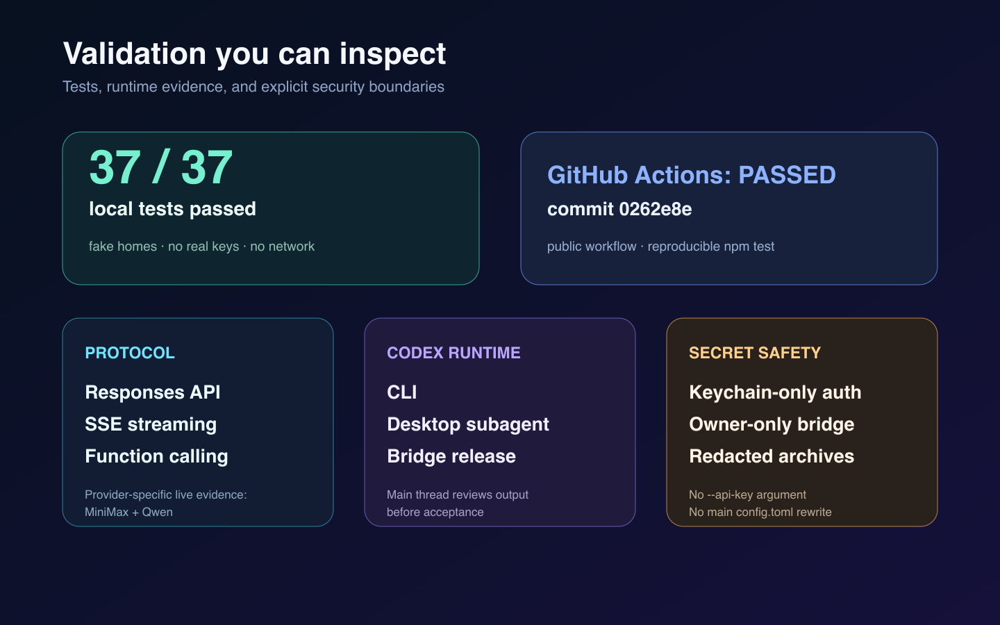

# Codex Third-Party Subagents

[](https://github.com/dhy365-creator/codex-third-party-subagents/actions/workflows/test.yml)
[](LICENSE)
[](#requirements)

**English** | [简体中文](README.zh-CN.md)

Delegate suitable Codex subagent tasks to lower-cost provider APIs while
**Codex stays the main agent**.



> Version line `0.4.0-beta.2`. Unofficial, macOS-only, and not endorsed by
> OpenAI, DeepSeek, MiniMax, or Alibaba Cloud.

## Codex stays the main agent

- Reviewed provider workers handle only one bounded, suitable text/code task at
  a time; they do not replace the main OpenAI model, authentication, or
  `~/.codex/config.toml`.
- Preflight checks quota, task suitability, credential readiness, and the
  owner-only single-slot bridge before delegation.
- Codex reviews the worker result and remains responsible for synthesis and
  final acceptance. Provider failure safely returns routing to an available
  OpenAI worker.

## Current provider status

| Built-in provider pack | Current evidence |
| --- | --- |
| DeepSeek V4 Flash | Built-in; controlled maintainer E2E passed (Level 3); generic user acceptance pending |
| MiniMax-M3 | API, CLI, and Codex Desktop runtime verified |
| Alibaba Model Studio Qwen3.7-Max | API, CLI, and Codex Desktop runtime verified |

Only reviewed built-in packs are supported. A compatibility request or
candidate listing is not proof of support; see the
[evidence matrix](docs/provider-compatibility.md).

DeepSeek V4 Pro is an explicit-only Custom Agent configuration profile
(`--model pro`), not an automatic fallback. A controlled maintainer coding
fixture E2E passed with attributable Host/provider/model metadata; public-installer
and independent user acceptance remain unverified. See the
[Custom Agents migration guide](docs/migration/custom-agents.md) and the
[sanitized Custom Subagents runtime record](docs/validation/deepseek-custom-subagents-runtime-e2e-2026-08-16.md).

## Documentation and community navigation

- [Quick Start](#quick-start)
- [Doctor](#doctor)
- [Architecture](docs/architecture.md)
- [Custom Agents migration](docs/migration/custom-agents.md)
- [Provider Compatibility](docs/provider-compatibility.md)
- [DeepSeek controlled runtime E2E](docs/validation/deepseek-runtime-e2e-2026-08-16.md)
- [DeepSeek Custom Subagents runtime E2E](docs/validation/deepseek-custom-subagents-runtime-e2e-2026-08-16.md)
- [DeepSeek V4 Pro probe](docs/validation/deepseek-v4-pro-probe-2026-08-16.md)
- [Demos](docs/demos/README.md)
- [FAQ](docs/faq.md)
- [Security](SECURITY.md)
- [Contributing](CONTRIBUTING.md)
- [Roadmap](ROADMAP.md)

## Quick start

The example uses DeepSeek; replace `deepseek` with `minimax` or `qwen` for
another built-in pack. Doctor is read-only: it does not install files, change
Codex configuration, print credentials, or call a paid provider API.

```sh
git clone https://github.com/dhy365-creator/codex-third-party-subagents.git
cd codex-third-party-subagents

/usr/bin/security add-generic-password \
  -a "$(id -un)" -s codex-deepseek-api-key -U -w

npm run doctor -- --provider deepseek

node scripts/install.mjs \
  --provider deepseek \
  --plan plus \
  --spark-available false \
  --luna-available true \
  --threshold 50 \
  --confirm-main-preserved \
  --consent-data
```

The installer remains a dry-run unless you explicitly add `--apply`. Review its
plan first, then see the [complete install guide](#requirements), restart Codex
Desktop after applying, and run `npm run verify -- --provider deepseek`.

Do not put API keys, credentials, private task text, private filesystem paths,
or sensitive data in issues, logs, or screenshots.

This is not an OpenAI product, a Codex replacement, a universal compatibility
layer, or evidence that a lower-cost model will produce a better result.

## Doctor

`npm run doctor` is the first validation step for a new setup.

- Read-only.
- No file mutations and no paid provider calls.
- Checks Custom Agent capability, identity, duplicates, and migration state.
- Good for triage before any provider delegation or installer action.

## Verified Codex Desktop run

The transcript below is a sanitized record of the real Qwen3.7-Max Desktop
subagent smoke test completed on 2026-08-08. It shows dispatch, the expected
worker response, bridge completion, and release; no API key or private task text
is included.



MiniMax-M3 and Qwen3.7-Max have passed real API, CLI, and Codex Desktop checks.
DeepSeek V4 Flash and the explicit-only V4 Pro profile have each passed a
bounded maintainer coding-fixture E2E in a new Host session: the selected Custom
Subagent reproduced the failing tests, identified the exact one-line fix, used
the expected provider/model, completed and released the bridge, and was reviewed
by the main thread. This is Level 3 evidence for those controlled paths, not a
general public-installer or user-acceptance claim; the verifier deliberately
continues to report `runtimeVerified: false`.

## Compatibility at a glance



| Direct provider path | Current evidence |
| --- | --- |
| DeepSeek V4 Flash | Built-in; controlled maintainer E2E passed (Level 3); verifier remains conservative |
| DeepSeek V4 Pro | Explicit-only Custom Agent profile; controlled maintainer E2E passed (Level 3); never auto-routed |
| MiniMax-M3 | Built-in; Desktop runtime verified |
| Alibaba Model Studio Qwen3.7-Max | Built-in; Desktop runtime verified |
| StepFun Responses models | Candidate; not runtime tested |
| Volcano Ark Responses models | Candidate; account model/Endpoint ID required |
| Qianfan / Tencent TokenHub | Gateway candidates; not proof of direct vendor compatibility |
| Direct Kimi K3 / Zhipu GLM / legacy Hunyuan / SiliconFlow | Not currently compatible with this repository's direct Responses contract |

See the evidence, source links, and exact boundaries in the
[Chinese-provider compatibility matrix](docs/provider-compatibility.md).

## How it works



The provider bridge accepts one owner-only task at a time, rejects unsafe file
states, and redacts task data before archival. The main thread still makes the
final decision.

## Validation and security



- `79/79` isolated local tests pass on the current branch, including Custom
  Agent schema, duplicate, migration, rollback, and project identity-shadowing
  coverage.
- GitHub Actions runs the same suite on macOS with Node.js 20 for pushes and
  pull requests.
- API keys are read from macOS Keychain, never accepted through `--api-key`.
- The bridge uses owner-only permissions and redacted atomic archives.
- Dry-run is the default; file changes require explicit `--apply`.

Read the [security policy](SECURITY.md) and [architecture](docs/architecture.md)
for the full threat boundary.

## Scope and boundaries

- Provider API use is billed separately from a Codex subscription.
- Review each provider's privacy, pricing, data-retention, and regional terms;
  provider behavior and compatibility can change independently of this project.
- Delegated task text is sent to the selected provider. Do not delegate
  credentials, private content, or material you are not authorized to send.
- Supported work is text, code, research synthesis, and local validation only.
  Images, files-as-multimodal-input, audio, video, browser control, desktop
  control, MCP, and computer use are out of scope.
- DeepSeek V4 Flash is the default fallback. `deepseek-v4-pro` is a separate
  explicit-only Custom Agent profile and is never auto-routed or silently
  substituted for Flash. Its controlled maintainer E2E does not establish broad
  public-installer or user acceptance. MiniMax
  supports `MiniMax-M3` only. Qwen supports the text-only `qwen3.7-max`
  model on Alibaba Model Studio pay-as-you-go.
- A configured `luna_worker` is expected when Luna is selected as the OpenAI
  fallback. This repository does not install or alter Luna.
- Codex Desktop does not guarantee native interception of every collaboration
  call. The preflight is a policy-assisted guardrail that the main agent must
  execute before every new spawn or follow-up.

## Routing policy

The account plan supplies defaults, but routing uses live quota data rather than
plan name alone.

| State | Selected worker |
| --- | --- |
| Spark has live quota | `spark-worker` |
| Spark unavailable; general quota above or equal to threshold | `luna_worker` |
| Spark unavailable; general quota below threshold; task suitable and bridge free | provider fallback (default: `deepseek_worker`) |
| Quota lookup fails | An available OpenAI worker; never provider fallback |
| Provider unsuitable/unavailable/bridge busy | `luna_worker` when available |

Suggested defaults:

- Plus: no Spark, Luna available, provider threshold `50%`.
- Pro with Spark: Spark first, Luna next, provider threshold `10%`.

## Requirements

- macOS and Codex Desktop with custom subagent support.
- Node.js `>=20`.
- Provider credentials in macOS Keychain.
- A working `luna_worker` if Luna fallback is enabled.

Downloading or cloning the repository is only the first step. Before the worker
can run, you must store the provider API key in Keychain, review a dry-run,
apply the configuration, restart Codex Desktop, and verify the installation.

## 0. Download the repository

```sh
git clone https://github.com/dhy365-creator/codex-third-party-subagents.git
cd codex-third-party-subagents
```

You can also download the GitHub ZIP and run the following commands from the
extracted directory.

## 1. Store the API key safely

Run in Terminal. Keep `-w` at the end so macOS prompts without putting key in
shell history:

Choose the service matching the pack you will install:

```sh
# DeepSeek
/usr/bin/security add-generic-password -a "$(id -un)" -s codex-deepseek-api-key -U -w

# MiniMax
/usr/bin/security add-generic-password -a "$(id -un)" -s codex-minimax-api-key -U -w

# Qwen / Alibaba Model Studio
/usr/bin/security add-generic-password -a "$(id -un)" -s codex-qwen-api-key -U -w
```

The installer only verifies that this Keychain item exists. It never accepts
`--api-key` and never writes secrets.

## 2. Review a dry-run

Dry-run is the default. It fetches the official provider catalog source as inert
text, extracts the supported catalog format, validates it, and keeps a reduced
text-only catalog for the selected provider pack.

Plus example:

```sh
node scripts/install.mjs \
  --provider deepseek \
  --plan plus \
  --spark-available false \
  --luna-available true \
  --threshold 50 \
  --confirm-main-preserved \
  --consent-data
```

Pro example:

```sh
node scripts/install.mjs \
  --provider deepseek \
  --plan pro \
  --spark-available true \
  --luna-available true \
  --threshold 10 \
  --confirm-main-preserved \
  --consent-data
```

For the explicit-only DeepSeek V4 Pro profile, add `--model pro` to a
reviewed dry-run. It never becomes the automatic fallback. If Doctor identifies
a matching legacy user Custom Agent, add `--migrate-legacy` only to the
reviewed apply command; see the [migration guide](docs/migration/custom-agents.md).

MiniMax and Qwen use the same routing options with `--provider minimax` or
`--provider qwen`. The installer
manages one selected provider fallback at a time; changing `--provider` changes
the actively routed provider pack without changing the main OpenAI thread.

For an offline installation, add
`--catalog-source /absolute/path/to/catalog-or-setup-script`.

## 3. Apply and verify

After reviewing the dry-run output, repeat with `--apply`, restart Codex Desktop,
and run:

```sh
node scripts/verify.mjs
```

Verification distinguishes two states:

- `configured: true`: installed files, permissions, hashes, catalog bounds,
  manifest markers, and Keychain presence are valid.
- `runtimeVerified: false`: the verifier does not auto-promote a controlled
  runtime observation. It stays false until this project defines and records a
  separate, independently accepted runtime-evidence policy.
- `agentEvidence` reports timestamped local identity checks by agent/provider/model;
  it has no Host runtime metadata and cannot verify a different model.

### Optional: support the project

After installation and verification succeed, a GitHub Star is appreciated if
the project is useful to you. It is completely optional and is never required
for installation or usage: [codex-third-party-subagents](https://github.com/dhy365-creator/codex-third-party-subagents).

## Uninstall

Preview first, then apply:

```sh
node scripts/uninstall.mjs
node scripts/uninstall.mjs --apply
```

Uninstall removes only the exact managed AGENTS block and hash-matching files.
If a managed file changed, it reports a conflict and performs no partial
removal. Pre-existing files are restored from owner-only backups when safe. Keychain
credentials and bridge archives are intentionally retained.

## Installed files

- `~/.codex/agents/<provider>_worker.toml`
- `~/.codex/model-catalogs/<provider-model>.json`
- `~/.codex/bin/subagent-preflight.mjs`
- `~/.codex/bin/codex-third-party-worker-bridge.mjs`
- `~/.codex/lib/codex-third-party-workers/`
- `~/.codex/codex-third-party-workers.json`
- `~/.codex/codex-third-party-workers-install.json`
- `~/.codex/codex-third-party-workers-backups/`
- one bounded AGENTS block in `~/.codex/AGENTS.md`

The `codex-third-party-workers` path and marker names above are the legacy
runtime namespace retained for safe upgrades and uninstall compatibility. They
do not change the public project name or repository slug.

The official catalog/prompt are acquired at install time and are not vendored in
this repository.

## Development

```sh
npm test
```

Tests use temporary fake homes and injected Keychain, quota, and network
implementations. They do not access real API keys, Keychain, Codex quota,
`~/.codex`, or network.

### Adding another provider pack

This release provides an extensible provider-pack core, not a claim that every
third-party model already works. DeepSeek V4 Flash, MiniMax-M3, and Qwen3.7-Max
are built-in, isolated-tested packs. Flash and the explicit-only V4 Pro profile
have Level 3 evidence for bounded maintainer coding-fixture E2Es; MiniMax-M3 and
Qwen3.7-Max have recorded real Codex Desktop subagent smoke tests. Generic user
acceptance and public-installer claims remain separately tracked.
New providers are added as reviewed code in `src/provider-packs.mjs` with tests;
the installer does not load arbitrary remote pack manifests.

A candidate provider must offer a Codex-compatible Responses API, command-backed
credential retrieval, a pinned HTTPS metadata origin, an explicit model/catalog
policy, bounded text/code capabilities, and deterministic offline tests. See
[architecture](docs/architecture.md) and [contributing](CONTRIBUTING.md).

See [configuration-zh](docs/configuration-zh.md),
[architecture](docs/architecture.md), [troubleshooting](docs/troubleshooting.md),
[Chinese-provider compatibility matrix](docs/provider-compatibility.md),
[copyable Codex install prompt](docs/CODEX_INSTALL_PROMPT.zh-CN.md), and
[security policy](SECURITY.md).

## Feedback and security

- [Report a bug](https://github.com/dhy365-creator/codex-third-party-subagents/issues/new?template=bug_report.yml)
- [Request provider compatibility](https://github.com/dhy365-creator/codex-third-party-subagents/issues/new?template=provider-compatibility.yml)
- [Propose a feature](https://github.com/dhy365-creator/codex-third-party-subagents/issues/new?template=feature_request.yml)
- [Report a security issue privately](SECURITY.md)

Never include credentials, private task text, private filesystem paths, or
sensitive vulnerability details in a public issue.

## Official references

- [OpenAI: Subagents](https://learn.chatgpt.com/docs/agent-configuration/subagents)
- [OpenAI: Codex configuration reference](https://learn.chatgpt.com/docs/config-file/config-reference)
- [DeepSeek: Codex integration](https://api-docs.deepseek.com/zh-cn/quick_start/agent_integrations/codex/)
- [DeepSeek: Responses API compatibility](https://api-docs.deepseek.com/zh-cn/guides/responses_api/)
- [MiniMax: M3 in Codex](https://platform.minimaxi.com/docs/token-plan/codex)
- [MiniMax: Responses API](https://platform.minimaxi.com/docs/api-reference/responses-create)
- [Alibaba Model Studio: Codex](https://help.aliyun.com/zh/model-studio/codex)
- [Alibaba Model Studio: Qwen3.7-Max](https://help.aliyun.com/zh/model-studio/qwen3-7-max)

## License

MIT. See [LICENSE](LICENSE).
