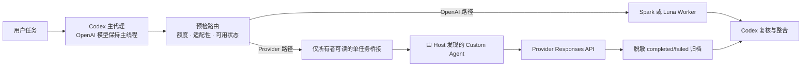

# Codex 第三方子代理

[](https://github.com/dhy365-creator/codex-third-party-subagents/actions/workflows/test.yml)
[](LICENSE)
[](#环境要求)

[English](README.md) | **简体中文**

把适合的 Codex 子代理任务委派给成本较低的 Provider API，同时让 **Codex 始终保持
主代理**。


> 当前版本线为 `0.4.0-beta.2`。本项目非官方、仅支持 macOS，未经 OpenAI、DeepSeek、
> MiniMax 或阿里云官方背书。

## Codex 始终是主代理

- 经过审查的 Provider Worker 每次只处理一个适配且边界明确的文本/代码任务，不替换
  主线程 OpenAI 模型、认证或 `~/.codex/config.toml`。
- 预检会先检查额度、任务适配性、凭据状态和仅所有者可访问的单任务桥接。
- Codex 仍负责复核、整合和最终验收；Provider 不可用时安全回到可用的 OpenAI Worker。

## 当前 Provider 状态

| 内置 Provider Pack | 当前证据 |
| --- | --- |
| DeepSeek V4 Flash | 已内置；受控维护者 E2E 已通过（Level 3）；通用用户验收仍待完成 |
| MiniMax-M3 | API、CLI 与 Codex Desktop 运行时已验证 |
| 阿里云百炼 Qwen3.7-Max | API、CLI 与 Codex Desktop 运行时已验证 |

只有经过审查的内置 Pack 才算受支持。兼容性申请或“候选”标记不等于已经支持；详细证据
见[兼容性矩阵](docs/provider-compatibility.zh-CN.md)。

DeepSeek V4 Pro 是仅能显式选择的 Custom Agent 配置 Profile（`--model pro`），不是
自动 fallback。带 Host/provider/model 归因的受控维护者代码 fixture E2E 已通过；公开
安装器与独立真实用户验收仍未完成。见
[Custom Agents 迁移说明](docs/migration/custom-agents.md)和
[脱敏 Custom Subagents 运行记录](docs/validation/deepseek-custom-subagents-runtime-e2e-2026-08-16.md)。

## 文档与社区导航

- [快速开始](#快速开始)
- [Doctor](#doctor)
- [架构说明](docs/architecture.md)
- [Custom Agents 迁移说明](docs/migration/custom-agents.md)
- [兼容性矩阵](docs/provider-compatibility.zh-CN.md)
- [DeepSeek 受控运行时 E2E](docs/validation/deepseek-runtime-e2e-2026-08-16.md)
- [DeepSeek Custom Subagents 运行时 E2E](docs/validation/deepseek-custom-subagents-runtime-e2e-2026-08-16.md)
- [DeepSeek V4 Pro 探测](docs/validation/deepseek-v4-pro-probe-2026-08-16.md)
- [演示（Demos）](docs/demos/README.md)
- [FAQ](docs/faq.zh-CN.md)
- [安全策略](SECURITY.md)
- [参与开发](CONTRIBUTING.md)
- [路线图](ROADMAP.md)

## 快速开始

下面使用 DeepSeek；使用其他内置 Pack 时可改为 `minimax` 或 `qwen`。Doctor 完全只读：
不会安装文件、修改 Codex 配置、输出凭据或调用付费 Provider API。

```sh
git clone https://github.com/dhy365-creator/codex-third-party-subagents.git
cd codex-third-party-subagents

/usr/bin/security add-generic-password \
  -a "$(id -un)" -s codex-deepseek-api-key -U -w

npm run doctor -- --provider deepseek

node scripts/install.mjs \
  --provider deepseek \
  --plan plus \
  --spark-available false \
  --luna-available true \
  --threshold 50 \
  --confirm-main-preserved \
  --consent-data
```

安装器默认仍是 dry-run，只有显式追加 `--apply` 才会写入。先检查计划，再阅读
[完整安装步骤](#环境要求)；应用后重启 Codex Desktop，并运行
`npm run verify -- --provider deepseek`。

不要在 issue、日志或截图中放入 API key、凭据、私密任务正文、私有文件路径或敏感数据。

本项目不是 OpenAI 官方产品，不是 Codex 替代品，不代表所有模型都兼容，也不证明成本
较低的模型一定能给出更好的结果。

## Doctor

`npm run doctor` 是新用户的第一步。

- 只读，不会变更文件。
- 不调用付费 API，不输出凭据。
- 在开始真实委派前检查环境、Provider/Model、凭据、fallback 提示和安装前置条件。
- 检查 Custom Agent capability、身份、重复项与迁移状态。

## 已验证的 Codex Desktop 运行记录

下图是 2026-08-08 真实 Qwen3.7-Max Desktop 子代理冒烟测试的脱敏记录，展示了任务
派发、预期返回、桥接完成和释放；不包含 API key 或私密任务正文。


MiniMax-M3 和 Qwen3.7-Max 已通过真实 API、CLI 与 Codex Desktop 检查。
DeepSeek V4 Flash 与仅显式选择的 V4 Pro Profile 均已在新 Host session 完成一次有边界
的维护者代码 fixture E2E：Custom Subagent 复现失败测试、指出准确的一行修复、使用预期
Provider/Model、完成并释放桥接，最后由主线程复核。这是这些受控路径的 Level 3 证据，
不是通用公开安装器或用户验收声明；验证器仍刻意输出 `runtimeVerified: false`。

## 兼容性速览


| 厂商直连路径 | 当前证据 |
| --- | --- |
| DeepSeek V4 Flash | 已内置；受控维护者 E2E 已通过（Level 3）；验证器保持保守状态 |
| DeepSeek V4 Pro | 仅显式选择的 Custom Agent Profile；受控维护者 E2E 已通过（Level 3）；绝不自动路由 |
| MiniMax-M3 | 已内置，Desktop 运行时已验证 |
| 阿里云百炼 Qwen3.7-Max | 已内置，Desktop 运行时已验证 |
| 阶跃星辰 Responses 模型 | 候选，尚未运行时验证 |
| 火山方舟 Responses 模型 | 候选，需要账号可用模型或 Endpoint ID |
| 百度千帆 / 腾讯云 TokenHub | 网关候选，不代表模型厂商直连兼容 |
| Kimi K3 / 智谱 GLM / 传统混元 / SiliconFlow 直连 | 当前不符合本仓库的直接 Responses 契约 |

完整证据、来源链接和限制见[国产模型 Provider 兼容性矩阵](docs/provider-compatibility.zh-CN.md)。

## 工作原理



Provider 桥接一次只允许一个仅所有者可读的任务，拒绝不安全的文件状态，并在归档前
脱敏任务内容。最终决定仍由主线程完成。

## 验证与安全


- 当前分支的 `72/72` 项隔离测试已通过，覆盖 Custom Agent schema、重复、迁移与回滚。
- GitHub Actions 会在 macOS + Node.js 20 上对 push 与 pull request 运行同一套测试。
- API key 只从 macOS Keychain 读取，不接受 `--api-key`。
- 桥接采用仅所有者权限和原子脱敏归档。
- dry-run 是默认行为，写入文件必须显式使用 `--apply`。

完整边界见[安全策略](SECURITY.md)与[架构说明](docs/architecture.md)。

## 使用边界

- 第三方 Provider 的 API 费用独立于 Codex 会员订阅。
- 请自行核对各 Provider 的隐私、价格、数据保留与地区政策；Provider 行为和兼容性可能
  独立于本项目发生变化。
- 被委派的任务正文会发送给所选 Provider。不得委派凭据、隐私内容或无权外发的资料。
- 仅适合文本、代码、研究整理和本地验证。图片、音频、视频、浏览器控制、桌面控制、
  MCP 和 Computer Use 不在支持范围内。
- DeepSeek V4 Flash 是默认 fallback。`deepseek-v4-pro` 是独立、仅显式选择的
  Custom Agent Profile，绝不自动路由或静默替换 Flash；其受控维护者 E2E 不等于通用
  公开安装器或用户验收。MiniMax
  只支持 `MiniMax-M3`；Qwen 只支持阿里云百炼按量计费的纯文本 `qwen3.7-max`。
- 路由需要 Luna 时，用户必须已经配置可用的 `luna_worker`；本仓库不会安装或修改 Luna。
- Codex Desktop 不保证原生拦截所有子代理调用。预检脚本是主代理必须在每次新派发或
  follow-up 前执行的策略护栏，并不是系统级安全边界。

## 路由策略

套餐只提供默认阈值，实际路由以实时额度为准。

| 当前状态 | 选择的 Worker |
| --- | --- |
| Spark 仍有实时额度 | `spark-worker` |
| Spark 不可用，通用额度大于或等于阈值 | `luna_worker` |
| Spark 不可用，通用额度低于阈值，任务适合且桥接空闲 | Provider fallback，默认 `deepseek_worker` |
| 额度查询失败 | 保留可用的 OpenAI Worker，不外发给 Provider |
| Provider 不适合、不可用或桥接繁忙 | 有 Luna 时回退到 `luna_worker` |

建议默认值：

- Plus：无 Spark，优先 Luna，Provider 阈值 `50%`。
- 含 Spark 的 Pro：Spark 优先，其次 Luna，Provider 阈值 `10%`。

## 环境要求

- macOS，以及支持自定义子代理的 Codex Desktop。
- Node.js `>=20`。
- 已准备好的第三方 Provider API 凭据。
- 启用 Luna 回退时，需要可用的 `luna_worker`。

仅下载或克隆仓库并不能立即使用。还需要把 API key 存入 macOS Keychain、执行
dry-run、确认后应用配置、重启 Codex Desktop，并完成安装验证。

## 0. 下载仓库

```sh
git clone https://github.com/dhy365-creator/codex-third-party-subagents.git
cd codex-third-party-subagents
```

也可以在 GitHub 下载 ZIP，解压后进入该目录执行后续命令。

## 1. 安全保存 API key

在 macOS Terminal 中执行。请保留命令末尾的 `-w`，系统会提示输入 API key，
避免把 key 写入普通命令参数或 shell 历史：

按准备安装的 Pack 选择 Keychain service：

```sh
# DeepSeek
/usr/bin/security add-generic-password -a "$(id -un)" -s codex-deepseek-api-key -U -w

# MiniMax
/usr/bin/security add-generic-password -a "$(id -un)" -s codex-minimax-api-key -U -w

# Qwen / 阿里云百炼
/usr/bin/security add-generic-password -a "$(id -un)" -s codex-qwen-api-key -U -w
```

安装器只检查该 Keychain 项是否存在，不接受 `--api-key` 参数，也不会把密钥写入文件。

## 2. 先执行 dry-run

dry-run 是默认行为。它会把官方 Provider 目录来源作为普通文本读取，提取并校验
受支持的目录格式，然后只保留 Provider Pack 允许的文本能力目录；不会执行下载内容。

Plus 示例：

```sh
node scripts/install.mjs \
  --provider deepseek \
  --plan plus \
  --spark-available false \
  --luna-available true \
  --threshold 50 \
  --confirm-main-preserved \
  --consent-data
```

Pro 示例：

```sh
node scripts/install.mjs \
  --provider deepseek \
  --plan pro \
  --spark-available true \
  --luna-available true \
  --threshold 10 \
  --confirm-main-preserved \
  --consent-data
```

MiniMax 与 Qwen 使用相同路由参数，只需把 Provider 改成 `--provider minimax`
或 `--provider qwen`。
安装器一次管理一个当前路由的 Provider fallback；切换 Pack 不会改变主线程 OpenAI
模型、Provider 或认证。

要检查仅显式选择的 DeepSeek V4 Pro Profile，在确认 dry-run 的命令中增加
`--model pro`。它绝不变成自动 fallback。若 Doctor 检出匹配的旧用户 Custom
Agent，只能在确认过的正式命令中增加 `--migrate-legacy`；见
[迁移说明](docs/migration/custom-agents.md)。

离线安装可以追加：

```sh
--catalog-source /absolute/path/to/catalog-or-setup-script
```

## 3. 应用配置并验证

检查 dry-run 输出无误后，在原命令末尾追加 `--apply`，然后重启 Codex Desktop 并运行：

```sh
node scripts/verify.mjs
```

验证结果分为两个层级：

- `configured: true`：文件、权限、hash、模型目录、AGENTS 标记和 Keychain 检查通过。
- `runtimeVerified: false`：验证器不会自动把一次受控运行时观察升级为已验证状态；在本项目
  定义并独立接受运行时证据策略前，它会保持为 `false`。
- `agentEvidence`：按 Agent / Provider / Model 输出带时间戳的本地身份检查；没有
  Host 运行时元数据，也不能验证其他模型。

### 可选：支持本项目

安装和验证成功后，如果本项目对你有帮助，欢迎在 GitHub 上给它一个 Star。这完全可选，
安装和使用从不以 Star 为条件：[codex-third-party-subagents](https://github.com/dhy365-creator/codex-third-party-subagents)。

## 卸载

先预览，再正式执行：

```sh
node scripts/uninstall.mjs
node scripts/uninstall.mjs --apply
```

卸载器只删除 hash 未变化的托管文件和精确匹配的 AGENTS 标记块。发现冲突时会停止，
不会部分卸载或覆盖用户修改。Keychain 凭据和桥接历史归档会被保留。

## 安装内容

- `~/.codex/agents/<provider>_worker.toml`
- `~/.codex/model-catalogs/<provider-model>.json`
- `~/.codex/bin/subagent-preflight.mjs`
- `~/.codex/bin/codex-third-party-worker-bridge.mjs`
- `~/.codex/lib/codex-third-party-workers/`
- `~/.codex/codex-third-party-workers.json`
- `~/.codex/codex-third-party-workers-install.json`
- `~/.codex/codex-third-party-workers-backups/`
- `~/.codex/AGENTS.md` 中一段有明确边界标记的规则

上述 `codex-third-party-workers` 路径和标记是为安全升级与卸载兼容保留的旧运行
namespace，不代表当前公开项目名称或 GitHub slug。

官方模型目录和提示词会在安装时获取，不会直接收录在本仓库中。

## 开发与扩展 Provider Pack

```sh
npm test
```

测试使用临时 fake home 和注入的 Keychain、额度及网络实现，不访问真实 API key、
Keychain、Codex 额度、`~/.codex` 或外部网络。

本项目提供的是可扩展 Provider Pack 核心，并不代表所有第三方模型已经可以直接使用。
DeepSeek V4 Flash、MiniMax-M3 与 Qwen3.7-Max 均已内置并通过隔离测试；Flash 与仅显式
选择的 V4 Pro Profile 均已有受控维护者代码 fixture E2E 的 Level 3 证据，MiniMax-M3 与
Qwen3.7-Max 还通过了真实 Codex Desktop 子代理冒烟测试。通用用户验收和公开安装器声明
仍单独记录。
新增 Provider 需要以经过代码审查的方式修改
`src/provider-packs.mjs` 并补充测试；安装器不会加载任意远程 Pack manifest。

候选 Provider 至少需要满足：兼容 Codex 使用的 Responses API、支持命令读取凭据、
固定 HTTPS 元数据来源、明确模型和目录校验规则、限定文本/代码能力，并提供确定性的
离线测试。

更多资料：

- [中文配置指南](docs/configuration-zh.md)
- [架构说明](docs/architecture.md)
- [故障排查](docs/troubleshooting.md)
- [国产模型 Provider 兼容性矩阵](docs/provider-compatibility.zh-CN.md)
- [可直接发送给 Codex 的安装提示词](docs/CODEX_INSTALL_PROMPT.zh-CN.md)
- [安全策略](SECURITY.md)

## 反馈与安全问题

- [报告 Bug](https://github.com/dhy365-creator/codex-third-party-subagents/issues/new?template=bug_report.yml)
- [申请 Provider 兼容性评估](https://github.com/dhy365-creator/codex-third-party-subagents/issues/new?template=provider-compatibility.yml)
- [提出功能建议](https://github.com/dhy365-creator/codex-third-party-subagents/issues/new?template=feature_request.yml)
- [私下报告安全问题](SECURITY.md)

公开 Issue 中不得包含凭据、私密任务正文、私有文件路径或敏感漏洞细节。

## 官方参考资料

- [OpenAI：Subagents](https://learn.chatgpt.com/docs/agent-configuration/subagents)
- [OpenAI：Codex 配置参考](https://learn.chatgpt.com/docs/config-file/config-reference)
- [DeepSeek：Codex 接入](https://api-docs.deepseek.com/zh-cn/quick_start/agent_integrations/codex/)
- [DeepSeek：Responses API 兼容说明](https://api-docs.deepseek.com/zh-cn/guides/responses_api/)
- [MiniMax：在 Codex 中使用 M3](https://platform.minimaxi.com/docs/token-plan/codex)
- [MiniMax：Responses API](https://platform.minimaxi.com/docs/api-reference/responses-create)
- [阿里云百炼：Codex](https://help.aliyun.com/zh/model-studio/codex)
- [阿里云百炼：Qwen3.7-Max](https://help.aliyun.com/zh/model-studio/qwen3-7-max)

## 开源协议

MIT，详见 [LICENSE](LICENSE)。
