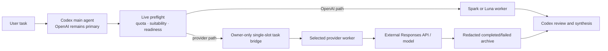

# Architecture

## Boundaries

- Main Codex model/provider/auth are never changed.
- DeepSeek is the default provider pack. MiniMax-M3 and Qwen3.7-Max are the
  second and third built-in packs.
  Additional providers are added as reviewed built-in definitions with tests;
  arbitrary remote pack manifests are intentionally not loaded.
- macOS Keychain is the only credential source.
- Dry-run is the default; file mutation requires `--apply`.
- Official provider metadata is acquired at install time, never vendored here.

### Read-only Doctor

`npm run doctor -- --provider <provider>` inspects the local prerequisites
before installation. It checks the platform, Node.js, recognizable Codex state,
owner-only permissions, the reviewed provider/model pairing, Keychain item
presence, OpenAI fallback hints, installed-manifest state, and prerequisites for
the existing verifier.

Doctor performs no writes, never asks Keychain to return a credential value,
does not print private paths, and makes no network or paid provider API call.
An uninstalled worker is reported separately from a blocker such as an invalid
provider, unsupported model, missing credential, or incompatible platform.

## Installed components

### Agent definition

`~/.codex/agents/<provider>_worker.toml` selects the provider pack model, defines
its model provider block, and reads credentials from Keychain. The installer never
writes `~/.codex/config.toml`.

### Runtime catalog

The installer reads the official provider catalog source as inert text (or a local
source for offline mode), enforces a size limit, extracts the pack's reviewed
heredoc or Markdown JSON format, parses JSON, manually follows a bounded redirect
chain while validating every destination against the pack host policy, and applies
pack policy:

- model identity target
- rejected model patterns (for the built-in DeepSeek pack, V4 Pro)
- required source modalities and an installed text-only capability boundary

The resulting catalog is written as owner-only runtime data.

A local catalog or saved setup script can be used for offline installation.

### Live preflight

`~/.codex/bin/subagent-preflight.mjs` reads Codex rate limits through the local
Codex app-server, verifies installed provider files and the Keychain item, and
applies the routing policy. Spark entitlement and live Spark remaining quota are
separate inputs. If quota lookup fails, routing stays on an OpenAI worker.

Before a provider role is selected, preflight atomically creates a single task
bridge. If that slot is busy or invalid, it falls back to OpenAI.

This is a policy-assisted guardrail. Codex Desktop collaboration calls are not
always guaranteed to be intercepted natively, so the AGENTS rules instruct the
main agent to run preflight before every new spawn or follow-up.

### Task bridge

The bridge root defaults to:

```text
/private/tmp/codex-third-party-worker-task-bridge-<uid>/
```

`active/` is mode `0700`; `active/task.json` is `0600`. The task validates:

- bridge version and `pending`/`running` status;
- task name and normalized final basename;
- absolute working directory and non-empty task message;
- regular-file/directory type, ownership, mode, and absence of symlinks.

Only one task may be active. Completion/failure replaces the active task body with
`[REDACTED]` values for `message` and `cwd`, then atomically renames the
`active` directory to a unique `completed-*` or `failed-*` archive.
Archives are never deleted automatically.

### Install manifest and uninstall

Every managed file records path, installed hash, mode, whether it pre-existed,
and owner-only backup state when needed. Reinstallation preserves backups when
managed files are unchanged.

Uninstall validates all actions before writing anything. It removes only exact hash
matches, restores validated backups, and removes only the exact AGENTS marker
block. Any conflict stops the whole uninstall plan.

## Data flow



## Verification levels

- `configured`: files, permissions, hashes, catalog rules, marker, and Keychain
  checks are valid locally.
- `runtimeVerified`: not claimed by verifier. It requires a real Codex task after
  restarting the app.
- `userAccepted`: separate from both local checks and runtime execution.
