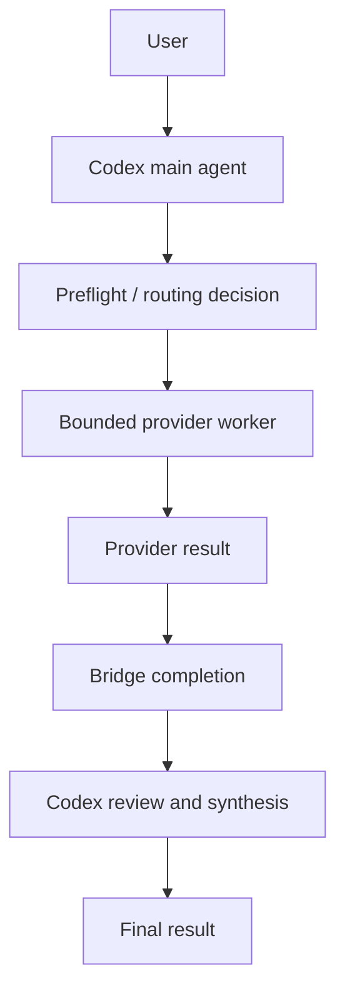

# Provider demo index

This repository keeps three evidence-based provider pages to help first-time
contributors and users understand what has and has not been verified:

- [Qwen3.7-Max demo](qwen-worker-demo.md)
- [MiniMax-M3 demo](minimax-worker-demo.md)
- [DeepSeek demo (controlled maintainer E2E; generic user acceptance pending)](deepseek-worker-demo.md)

All pages use existing repository evidence only:

- current-state records;
- the compatibility matrix;
- merged PR evidence; and
- the existing sanitized terminal image where available.

## Project flow

This is the project design. The recorded MiniMax and Qwen runs prove selected
worker execution, result return, bridge completion, and main-thread review; they
do not by themselves prove automatic preflight selection in every session.

## Boundaries

- A provider worker handles one bounded suitable task; it does not take over the
  Codex session.
- Codex remains responsible for review, synthesis, and final acceptance.
- Provider failure should return control to the available OpenAI path.
- Credentials and private task content are not included in public evidence.
- Evidence for automatic routing is not inferred from a single recorded run.
- Provider runtime verification status is tracked explicitly per page.
